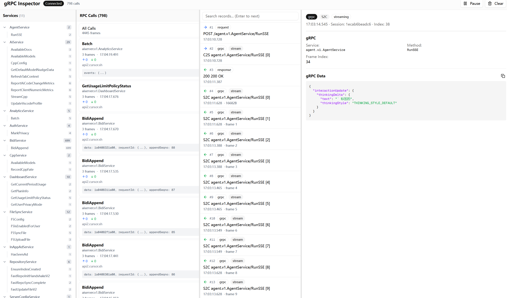

# Cursor-Tap

中文 | [English](./README_EN.md)

Cursor IDE gRPC 中间人流量分析工具。可以解密 TLS、反序列化 protobuf、实时展示 AI 对话产生的RPC请求和响应。



## 为什么做这个

Cursor 和后端的通信全是 gRPC，走的 Connect Protocol，body 是二进制 protobuf。用 Burp 或 Fiddler 抓到的都是一堆看不懂的二进制。官方也没公开 proto 定义，想看 AI 对话的具体内容很麻烦。

这个工具能把流量解密成可读的 JSON，还能实时看到 streaming 的每一帧。

## 文档

- [项目架构](./docs/architecture.md) — monorepo 结构、模块职责、数据流与 API
- [Cursor 逆向笔记 1 —— 我是如何拦截解析 Cursor 的 gRPC 通信流量的](./docs/cursor-reverse-notes-1.md)

## 原理

1. **MITM 代理**：在 Cursor 和 api2.cursor.sh 之间插一层，用自签 CA 解密 TLS
2. **Proto 提取**：从 Cursor 客户端的 JS 代码里提取出 proto 定义（藏在 `protobuf-es` 编译产物里）
3. **实时解析**：解析 Connect Protocol 的 envelope framing，反序列化每一帧 protobuf
4. **WebUI 展示**：用 WebSocket 实时推送到前端，四栏布局展示服务树、调用列表、帧列表、详情

## 快速开始

### 使用 Nx（推荐）

```bash
pnpm install

# 同时启动代理 + WebUI
pnpm dev

# 或分别启动
pnpm dev:tap    # Go 代理（:8080 / :1080 / :9090）
pnpm dev:web    # Next.js WebUI（:3000）

# 其他常用命令
pnpm build:tap  # 构建 Go 二进制 → dist/tap
pnpm build:web  # 构建前端
pnpm exec nx run proto:generate  # buf generate
pnpm exec nx test tap     # go test ./tests/...
```

### 手动启动

#### 1. 启动代理

```bash
go run ./apps/tap start --http-parse --http-record ./access.log
```

默认监听 `localhost:8080`（HTTP 代理）、`localhost:1080`（SOCKS5）和 `localhost:9090`（API + WebSocket）。

#### 2. 配置 Cursor

设置环境变量让 Cursor 走代理并信任自签 CA：

```bash
# Windows
set HTTP_PROXY=http://localhost:8080
set HTTPS_PROXY=http://localhost:8080
set NODE_EXTRA_CA_CERTS=C:\path\to\ca.crt

# macOS/Linux
export HTTP_PROXY=http://localhost:8080
export HTTPS_PROXY=http://localhost:8080
export NODE_EXTRA_CA_CERTS=/path/to/ca.crt
```

CA 证书在首次启动时自动生成，位置是 `~/.cursor-tap/ca/ca.crt`。

#### 3. 启动 WebUI

```bash
pnpm dev:web
# 或 cd apps/web && pnpm dev
```

打开 `http://localhost:3000` 就能看到流量了。

## 项目结构

```
├── apps/
│   ├── tap/            # Go CLI 代理入口（Nx: tap）
│   └── web/            # Next.js Web Inspector（Nx: web）
├── internal/
│   ├── ca/             # 自签 CA，动态域名证书
│   ├── config/         # 应用配置
│   ├── proxy/          # HTTP/SOCKS5/API 三服务编排
│   ├── mitm/           # TLS MITM、HTTP/2 桥接
│   ├── httpstream/     # HTTP/gRPC/SSE 流解析与录制
│   └── api/            # REST + WebSocket Hub
├── packages/proto/     # Protobuf 定义 + buf 生成（Nx: proto）
├── tests/              # Go 单元测试
├── tools/              # 开发工具（ext / restore / inline 等）
└── docs/               # 架构文档与逆向笔记
```

详见 [项目架构](./docs/architecture.md)。

## 能看到什么

- `AiService/RunSSE`：AI 对话的主通道，包括 AI 思考、文本生成、工具调用
- `BidiService/BidiAppend`：用户消息和工具执行结果
- `AiService/StreamCpp`：代码补全请求和建议
- `CppService/RecordCppFate`：补全结果的接受/拒绝反馈
- `AiService/Batch`：用户行为上报
- 其他几十个 RPC 方法...

